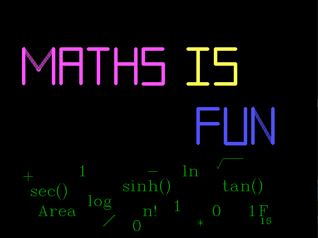
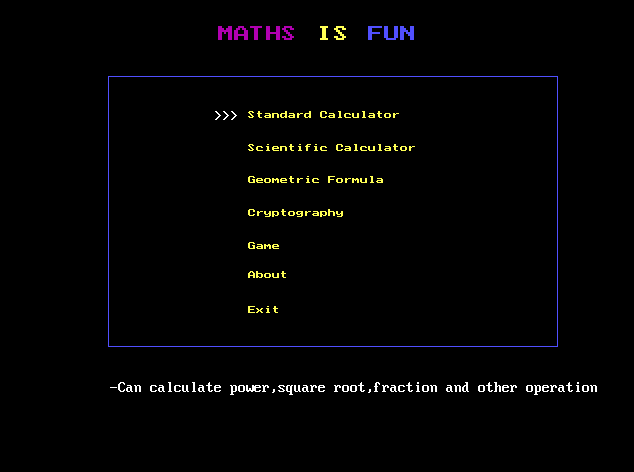

# Math Is Fun
### Scientifc Calculator and Math Games.

1. **Installation On Window**
1. **About Project**

## 1-Installation On Window

## __Step-1__

> Download and Install Turbo C ( https://archive.codeplex.com/?p=turboc )

## __Step-2__
> *Copy* the project CPP file and paste it to *C:\TurboC3\bin\\*

## __Step-3__
> Go to *Options*-> *Compiler* -> *Code Generation*, Change *Model* to __Huge__

## __Step-4__
> Go to *Options* -> *Linker* -> *Libraries*, check mark [x] on **Graphic Library**

## __Step-5__
> Go to *C:\TURBOC3\BGI* , copy all files and paste it on *C:\TURBOC3\BIN*

## __Step-6__
> **Compile** and **Run**. *Have Fun with Math!*

## 2-About Project

Math-is-Fun is a C++ project created by students on August 1, 2017.

### __Functionality__

| Name                | Description          |
| ------------------- | -------------- |
| Standard Calculator | Calulate basic operation(add,subtract,divide,multiply) |
| Scientific Calculator | Sciencific opertion(matrix,lograrithm,trigonometry) |
| Geometric Formula | Find area,volume,perimeter of various shape|
| Cryptography | Encrypt,decrpyt sentences with key |
| Game | Fast Math, Puzzle, Fifteen Tic Tac Toe |
